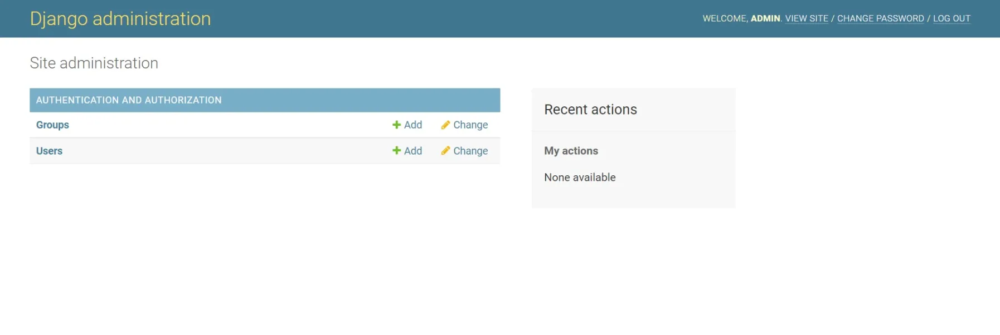

# Гайд по установке Django на Apache2

1. **Обновляем Ubuntu**
```bash
sudo apt update -y & sudo apt upgrade -y
```
3. **Качаем важные либы**
```bash
sudo apt install mysql-server libmysqlclient-dev git curl build-essential libssl-dev zlib1g-dev ibbz2-dev libreadline-dev libsqlite3-dev libncursesw5-dev xz-utils tk-dev libxml2-dev libxmlsec1-dev libffi-dev liblzma-dev apache2 libapache2-mod-wsgi-py3
```
4. **Ставим Pyenv**
```bash
curl https://pyenv.run | bash
```
5. **Загружаем в Env**
```bash
echo 'export PYENV_ROOT="$HOME/.pyenv"' >> ~/.bashrc
echo 'command -v pyenv >/dev/null || export PATH="$PYENV_ROOT/bin:$PATH"' >> ~/.bashrc
echo 'eval "$(pyenv init -)"' >> ~/.bashrc
exec "$SHELL"
```
6. **Устанавливаем Python 3.10**
```bash
pyenv install 3.10
pyenv global 3.10
```
7. **Запускаем Apache2**
```bash
systemctl start apache2
systemctl enable apache2
systemctl status apache2
```
8. **Запускаем MySQL**
```bash
systemctl start mysql
systemctl enable mysql
systemctl status mysql
```
9. **Создаем базу и юзера в MySQL**
```bash
mysql -u root
```
```sql
CREATE DATABASE django_db;
CREATE USER 'django_user'@'localhost' IDENTIFIED BY 'Pa$$word';
GRANT ALL ON django_db.* TO 'django_user'@'localhost';
FLUSH PRIVILEGES;
EXIT;
```
10. **Создаем директорию Django**
```bash
sudo mkdir /home/django_project/
cd /home/django_project/
```
11. **Создаем venv**
```bash
pyenv virtualenv 3.10 django_env
pyenv activate django_env
```
12. **Ставим либы python**
```bash
pip install django mysqlclient
```
13. **Стартуем проект**
```bash
django-admin startproject django_app .
```
14. **Запишите данные в настройки**
```bash
nano django_app/settings.py
```
```python
import os
STATIC_URL='/static/'
STATIC_ROOT=os.path.join(BASE_DIR, 'static/') 

ALLOWED_HOSTS = ['*']

MEDIA_URL='/media/'
MEDIA_ROOT=os.path.join(BASE_DIR, 'media/')
```
Если будете юзать Sqlite
```python
DATABASES = {
    'default': {
        'ENGINE': 'django.db.backends.sqlite3',
        'NAME': os.path.join(BASE_DIR, 'db.sqlite3'),
    }
}
```
Если будете юзать MySQL
```python
DATABASES = {
    'default': {
      'ENGINE': 'django.db.backends.mysql',
      'NAME': 'django_db',
      'USER': 'django_user',
      'PASSWORD': 'Pa$$word',
      'HOST': '127.0.0.1',
      'PORT' : '3306',
    }
}
```
15. **Делаем миграции и создаем супер пользователя**
```bash
python manage.py  makemigrations
python manage.py  migrate
python manage.py createsuperuser
python manage.py collectstatic
```
16. **Выходим из Venv**
```bash
pyenv deactivate
```
17. **Записываем конфигурацию Apache2**
```bash
nano /etc/apache2/sites-available/django.conf
```
Получите путь к питону с помощью команды и вставьте в конфиг:
```bash
which python
```
```conf
<VirtualHost *:80>

        ServerAdmin admin@your-domain.com
        ServerName your-domain.com
        ServerAlias www.your-domain.com

        DocumentRoot /home/django_project/

        ErrorLog ${APACHE_LOG_DIR}/your-domain.com_error.log
        CustomLog ${APACHE_LOG_DIR}/your-domain.com_access.log combined

        Alias /static /home/django_project/static
        <Directory /home/django_project/static>
                Require all granted
        </Directory>

        Alias /media /home/django_project/media
        <Directory /home/django_project/media>
                Require all granted
         </Directory>

        <Directory /home/django_project/django_app>
                <Files wsgi.py>
                        Require all granted
                </Files>
        </Directory>

        WSGIDaemonProcess django_app python-path=/home/django_project python-home=ПУТЬ/ДО/ПИТОНА
        WSGIProcessGroup django_app
        WSGIScriptAlias / /home/django_project/wsgi.py

</VirtualHost>
```
18. **Инжектим конфиг**
```bash
a2ensite django.conf
```
19. **Перезапускаем apache**
```bash
systemctl restart apache2
```
